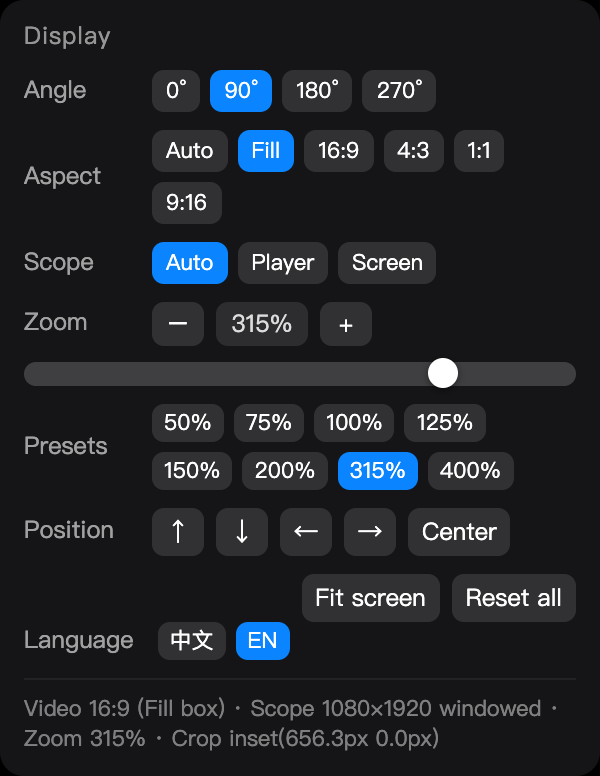

# Video Rotate · Safari Userscript

[简体中文](README.md) · **English**

[](https://github.com/daletyler1737/safari-video-rotate/releases)
[](LICENSE)


A Safari userscript for watching landscape videos on a **portrait monitor**: it adds three small icons
(**rotate / settings / fullscreen**) to the player controls, and one click turns the video 90° and fills
your portrait screen — **and it keeps working in fullscreen**. Aspect presets crop instead of stretch,
and the zoom bar jumps straight to wherever you click.

The UI is **bilingual (Chinese / English)**: it follows your browser language automatically, and you can
switch it manually from the panel.

Works with the free [Userscripts](https://apps.apple.com/app/id1463298887) extension (App Store).



> On a 1080×1920 portrait screen, one click on ⟳ makes a landscape video fit the whole screen —
> no more fiddling with angle, aspect, zoom and offset.

---

## Why this exists

Watching landscape video in Safari on a portrait / rotated screen runs into a chain of problems:

| Problem | What happens |
|---|---|
| Rotation is lost as soon as you hit the browser's fullscreen button | Safari uses **WebKit native video fullscreen**; that layer is rendered by the browser itself, so the page's CSS `transform` has no effect at all |
| The picture is thin and off-centre | If you treat the player's small box as the display area in fullscreen, the computed size is about 1/3 of what it should be — you end up zooming to 300% just to fill the screen |
| Forcing an aspect ratio distorts the picture | Stretching to 4:3 / 1:1 squashes the image |

How this script handles it:

- **Takes over fullscreen**: clicking the player's fullscreen button is redirected to DOM fullscreen, so
  rotation / aspect / zoom keep working there. If native fullscreen somehow gets entered anyway, a
  `webkitbeginfullscreen` listener exits it and switches back to DOM fullscreen.
- **Display area = the whole screen**: in fullscreen the picture box is `window.innerWidth/innerHeight`,
  instead of being misled by the small inline size the player writes (e.g. 1080×607).
- **Forced aspect ratios crop, never stretch**: the video is scaled up to cover the box and the overflow
  is cut with `clip-path`, so the image is never distorted.

---

## Features

**Three icons in the player controls** (left of YouTube's gear button / right side of Bilibili's controls)

| Icon | Action |
|---|---|
| ⟳ | Rotate 90° (hold Shift to go the other way) |
| ⚙ | Open the settings panel (clicking elsewhere closes it) |
| ⛶ | Fullscreen / exit fullscreen |

In fullscreen these buttons park in the **bottom-right corner** and sit a bit higher, clear of the player's own control bar.

**The settings panel**

- Angle: `0° / 90° / 180° / 270°`, one click each
- Aspect: `Auto` (fit without distortion) / `Fill` (fill the frame, no letterboxing) /
  `16:9 / 4:3 / 1:1 / 9:16` (cropped, not stretched)
- Scope: `Auto / Player / Screen`
- Zoom: **the bar takes a full row — click anywhere and that's the zoom.** Clicking a spot jumps straight
  to that percentage, dragging scrubs along, plus `−` / `+`, preset chips (50/75/100/125/150/200/315/400%)
  and mouse-wheel control
- Position: ↑ ↓ ← → nudging + `Center`
- `Fit screen` / `Reset all`
- Language: `中文 / EN`
- A live status line at the bottom (video AR, display size, zoom, crop) — if something looks wrong,
  a screenshot of that line pinpoints the cause

**Keyboard**

| Key | Action |
|---|---|
| `⌥R` | Rotate 90° (`⌥⇧R` reverse) |
| `⌥0` | Reset everything |
| `⌥=` / `⌥−` | Zoom in / out (hold to repeat) |
| `F` | Fullscreen / exit |
| Wheel (hover the zoom row) | ±10% by default; `⇧` fine 2%; `⌥` coarse 50% |
| Hold `−` / `+` | After 240 ms it repeats continuously — about 100% → 300% in one second |

Angle / aspect / zoom / scope / language are **remembered per site**. In the default state
(0° / Auto / 100%) the script doesn't touch a single style on the page.

---

## UI language

Three ways to install, identical in features — pick one:

| Build | Language behaviour | Notes |
|---|---|---|
| **Bilingual** (root `视频旋转.user.js`) | Follows the browser language (`zh*` → Chinese, otherwise English), and you can switch manually in the panel's last row | **Recommended** |
| **Chinese pack** (`dist/video-rotate.zh.user.js`) | Locked to Chinese, no switch | Smaller, if you only want Chinese |
| **English pack** (`dist/video-rotate.en.user.js`) | Locked to English, no switch | Smaller, if you only want English |

A manual switch applies to the current site only; the choice is stored in `localStorage` and takes
precedence over the browser language.

In English the panel widens automatically and the label column is wider
(`Language` / `Position` are much longer than their Chinese counterparts).

The packs are **generated files** — don't edit them. Edit the `STRINGS` tables in the main script and run:

```bash
node tools/build-lang-packs.mjs
```

> Note: source comments are written in Chinese. The English pack translates the user interface, not the comments.

---

## Install

1. Install [Userscripts](https://apps.apple.com/app/id1463298887) from the App Store (macOS 12+ / Safari 14.1+).
2. Safari → Settings → Extensions → tick **Userscripts**.
3. Open YouTube, click the "AA / size" button in the address bar → Extensions → Userscripts → **Always Allow**.
4. Install one of the builds (the link opens Userscripts' install prompt):

   | Build | Install link |
   |---|---|
   | Bilingual (recommended) | **[视频旋转.user.js](https://raw.githubusercontent.com/daletyler1737/safari-video-rotate/main/%E8%A7%86%E9%A2%91%E6%97%8B%E8%BD%AC.user.js)** |
   | Chinese pack | [video-rotate.zh.user.js](https://raw.githubusercontent.com/daletyler1737/safari-video-rotate/main/dist/video-rotate.zh.user.js) |
   | English pack | [video-rotate.en.user.js](https://raw.githubusercontent.com/daletyler1737/safari-video-rotate/main/dist/video-rotate.en.user.js) |

   Or grab a file from the [**Releases**](https://github.com/daletyler1737/safari-video-rotate/releases) page.

5. **Quit Safari completely with `Command+Q` and reopen it** — reloading the page is not enough for the
   extension to re-read the script.

The extension's real script directory:

```
~/Library/Containers/com.userscripts.macos.Userscripts-Extension/Data/Documents/scripts/
```

Manuals (fullscreen internals, what every option means, troubleshooting):

- English: [`USAGE.en.txt`](USAGE.en.txt)
- 中文: [`使用说明.txt`](使用说明.txt)

---

## Known limitations

- **Bilibili danmaku (bullet comments) don't rotate with the video** — they're a separate layer. Rotating
  them too would require rotating the whole screen (a system-level rotation).
- Fullscreen detection needs three signals combined:
  `document.fullscreenElement || native video fullscreen (webkitDisplayingFullscreen) || we just requested it` —
  any one of them alone misses cases.
- Tested on macOS 12.7.6 + Safari 15.6.1 with YouTube / Bilibili. Other environments are untested.
- The script's philosophy is "don't touch the page unless necessary": it only writes inline properties it
  owns, backs up the original values on the element, and can restore the page exactly.
- Source comments are in Chinese.

---

## Tests

The repo ships a real-engine (Chromium) test suite covering geometry, fullscreen, zoom interaction,
the bilingual UI and the language packs:

```bash
cd _test
npm i playwright-core@1.44.0        # macOS 12 can't run anything newer
npx playwright install chromium     # chromium-1117

node test.mjs                       # 18  geometry regression
node test-zoom.mjs                  # 13  zoom interaction + button placement
node test-zoomclick.mjs             # 15  "click the bar, land exactly there"
node test-i18n.mjs                  # 12  language detection / switching / persistence
node ../tools/build-lang-packs.mjs  # generate dist/ language packs first
node test-langpacks.mjs             # 12  language-lock verification
node test-fullscreen.mjs            # real YouTube fullscreen (needs real mouse gestures, headed mode)
```

Current status: **test.mjs 18/18 · test-zoom.mjs 13/13 · test-zoomclick.mjs 15/15 ·
test-i18n.mjs 12/12 · test-langpacks.mjs 12/12** (70 assertions total).

Notes that double as the pitfalls this script hit:

- **Fullscreen can't be tested headless**: `requestFullscreen()` doesn't fire; you need headed mode.
- **Real mouse events are required** to trigger fullscreen — `el.click()` isn't a user gesture and gets rejected.
- After `clip-path` is applied, `getBoundingClientRect()` still reports the uncropped bounding box, so
  assertions must read the script's exported state (`window.__dalDbg`) instead of inferring from the DOM.
- On Trusted Types sites (YouTube) you can't use `addScriptTag`; use `addInitScript`.
- To test the language you must override `navigator.language` **before the script is injected** —
  and since `localStorage` is unavailable on `about:blank`, the persistence tests fake a real origin via `page.route`.

---

## Releases

- Changelog: [Releases](https://github.com/daletyler1737/safari-video-rotate/releases)
- Every release attaches all three installable `.user.js` files (bilingual / Chinese / English).
- Release flow: bump the version → `node tools/build-lang-packs.mjs` → run the tests → commit & push → create the release.

---

## Development: git can't reach GitHub?

When `git clone` / `git push` fails, it's usually because **the proxy isn't configured for git** —
git does **not** read the macOS *System Settings → Network → Proxies* settings, so your browser can open
GitHub while git still times out.

```bash
git config --global http.https://github.com/.proxy http://127.0.0.1:7897   # only route github through the proxy
git config --global credential.helper osxkeychain                          # remember credentials
```

> Two gotchas:
> 1. Mirrors like `gh-proxy.com` / `ghproxy.net` are **read-only accelerators and cannot `git push`**;
>    if you also have a `url.*.insteadOf` rewrite pointing `github.com` at a mirror, your pushes go there.
> 2. Trying to claw pushes back with `pushInsteadOf` doesn't work either: when its prefix is the **same
>    length** as `insteadOf`'s, git picks `insteadOf` and your rule is silently ignored.

If `git push` is still unavailable, the repo includes `tools/sync-to-github.py`, which uploads through the
GitHub REST API instead (it compares content hashes and only sends changed files):

```bash
GH_TOKEN=your_token python3 tools/sync-to-github.py "commit message"
```

---

## License

[MIT](LICENSE)
