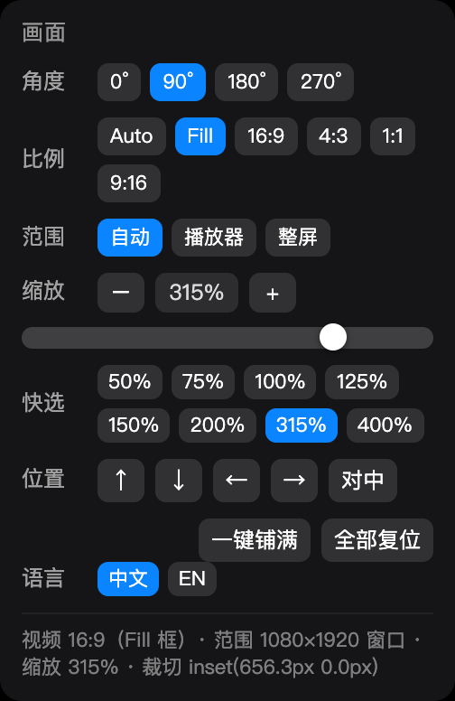

# 视频旋转 · Safari 用户脚本

给 Safari 看 YouTube / B 站用的用户脚本：在播放器控制栏加三个小图标（**旋转 / 设置 / 全屏**），
一键把横着的视频转 90° 铺满竖屏，**全屏后依然生效**，比例可选裁切，缩放**点哪就多大**。

配合 [Userscripts](https://apps.apple.com/app/id1463298887) 扩展使用（免费，App Store）。



> 竖屏 1080×1920 上，横视频点一下 ⟳ 就正好铺满整块屏幕，不用再调角度、比例、缩放、位移。

---

## 为什么需要它

在竖屏 / 旋转过的屏幕上用 Safari 看横版视频，会遇到一串连锁问题：

| 问题 | 表现 |
|---|---|
| 浏览器全屏按钮一按，旋转就丢了 | Safari 走的是 **WebKit 原生视频全屏**，那一层由浏览器自己渲染，页面的 CSS `transform` 完全不起作用 |
| 画面又瘦又偏 | 全屏时若把播放器小框当成显示区，算出来的尺寸只有应有的 1/3，得手动放大到 300% 才勉强铺满 |
| 强制比例会变形 | 直接拉伸成 4:3 / 1:1 会把画面压扁 |

本脚本的处理方式：

- **接管全屏**：点播放器的全屏按钮时改走 DOM 全屏，旋转 / 比例 / 缩放在全屏下照常生效；
  万一进了原生全屏，监听 `webkitbeginfullscreen` 自动退出并切回 DOM 全屏。
- **显示区 = 整块屏幕**：全屏时画面框取 `window.innerWidth/innerHeight`，
  不再被播放器内联写死的小尺寸（如 1080×607）带偏。
- **强制比例只裁不拉伸**：等比放大到盖住画面框，超出部分用 `clip-path` 裁掉，画面不变形。

---

## 功能

**控制栏三个小图标**（位置：YouTube 齿轮「设置」按钮左边 / B 站控制栏右侧）

| 图标 | 作用 |
|---|---|
| ⟳ | 旋转 90°（按住 Shift 反向） |
| ⚙ | 打开设置抽屉（点页面别处自动收起） |
| ⛶ | 全屏 / 退出全屏 |

全屏时这组按钮自动停到屏幕**右下角**常驻，抬高一截避开播放器自己的控制栏。

**设置抽屉**

- 角度：`0° / 90° / 180° / 270°` 直接点
- 比例：`Auto`（自适应不变形）/ `Fill`（铺满不留黑边）/ `16:9 / 4:3 / 1:1 / 9:16`（裁切不变形）
- 范围：`自动 / 播放器 / 整屏`
- 缩放：**长条独占一整行，点哪就多大** —— 点长条任意位置立刻跳到该百分比，按住拖动跟手；
  另有 `−` / `+`、快选档位（50/75/100/125/150/200/315/400%）、滚轮调节
- 位置：↑ ↓ ← → 微调 + `对中`
- `一键铺满` / `全部复位`
- 底部一行实时状态（视频比例、显示区尺寸、缩放、裁切量），出问题时截图这一行即可定位

**快捷键**

| 按键 | 作用 |
|---|---|
| `⌥R` | 旋转 90°（`⌥⇧R` 反向） |
| `⌥0` | 全部复位 |
| `⌥=` / `⌥−` | 放大 / 缩小（可按住连发） |
| `F` | 全屏 / 退出全屏 |
| 滚轮（悬停缩放行） | 默认 ±10%；`⇧` 细调 2%；`⌥` 粗调 50% |
| 长按 `−` / `+` | 240ms 后开始连调，按住 1 秒约 100% → 300% |

角度 / 比例 / 缩放 / 范围**按网站分别记忆**。默认状态（0° / Auto / 100%）脚本不改动页面任何样式。

---

## 安装

1. App Store 安装 [Userscripts](https://apps.apple.com/app/id1463298887)（要求 macOS 12+ / Safari 14.1+）。
2. Safari → 设置 → 扩展 → 勾选 **Userscripts**。
3. 打开 YouTube，点地址栏左侧的「大小 / AA」→ 扩展 → Userscripts → **总是允许**。
4. 安装脚本：点这里 → **[视频旋转.user.js](https://raw.githubusercontent.com/daletyler1737/safari-video-rotate/main/%E8%A7%86%E9%A2%91%E6%97%8B%E8%BD%AC.user.js)**
   （Userscripts 会弹出安装界面；也可以手动把文件放进扩展的 scripts 目录，见下）
5. **`Command+Q` 完全退出 Safari 再打开**（只刷新页面不够，扩展才会重读脚本）。

扩展的真实脚本目录：

```
~/Library/Containers/com.userscripts.macos.Userscripts-Extension/Data/Documents/scripts/
```

详细中文说明见 [`使用说明.txt`](使用说明.txt)（含全屏原理、参数含义、常见问题）。

---

## 已知限制

- **B 站弹幕不跟着转**：弹幕是独立图层。要连弹幕一起转，只能转整块屏幕（系统级旋转）。
- 全屏判断需要三路合并：`document.fullscreenElement || 原生视频全屏(webkitDisplayingFullscreen) || 自己刚请求过全屏`，
  单独任何一路都会漏。
- 在 macOS 12.7.6 + Safari 15.6.1 + YouTube / Bilibili 上实测通过；其它环境未验证。
- 脚本是"能不动页面就不动"的取向：只写自己用过的内联属性，并在元素上备份原值，还原时可精确回到原样。

---

## 测试

仓库带一套真实引擎（Chromium）跑的自动化测试，覆盖几何、全屏、缩放交互：

```bash
cd _test
npm i playwright-core@1.44.0        # macOS 12 最高只能用到这个版本
npx playwright install chromium     # 对应 chromium-1117
node test.mjs                       # 18 项几何回归
node test-zoom.mjs                  # 13 项缩放交互 + 按钮位置
node test-zoomclick.mjs             # 15 项「长条点哪就多大」
node test-fullscreen.mjs            # 真实 YouTube 全屏专项（需要真实鼠标手势，headed 模式）
```

测试要点（也是这份脚本踩过的坑）：

- **headless 测不了全屏**：`requestFullscreen()` 不生效，必须 headed。
- **必须用真实鼠标事件**触发全屏，`el.click()` 不算用户手势，会被拒。
- 启用 `clip-path` 后 `getBoundingClientRect()` 仍返回未裁剪的外接矩形，
  断言得读脚本导出的内部值（`window.__dalDbg`），不能从 DOM 反推。
- Trusted Types 站点（YouTube）不能用 `addScriptTag`，要用 `addInitScript`。

当前状态：**test.mjs 18/18 · test-zoom.mjs 13/13 · test-zoomclick.mjs 15/15**。

---

## 网络说明（本机开发环境）

`git clone` / `git push` 连不上 GitHub 时，多半是**代理没配到 git 上** ——
git **不会**自动读取 macOS「系统设置 → 网络 → 代理」，所以浏览器能开 GitHub，git 照样超时。

本机可用的配置（只让 github.com 走本地代理，gitee 等其它站点不受影响）：

```bash
git config --global http.https://github.com/.proxy http://127.0.0.1:7897
git config --global credential.helper osxkeychain    # 记住凭据，不用每次输 token
```

> 两个坑：
> 1. `gh-proxy.com` / `ghproxy.net` 这类镜像**只做只读加速，不能用于 `git push`**；
>    若同时配了 `url.*.insteadOf` 把 `github.com` 重写到镜像，push 会被带偏。
> 2. 想用 `pushInsteadOf` 把 push 拉回原生也不行：当它与 `insteadOf` 的前缀**一样长**时，
>    git 取 `insteadOf` 胜出，那条规则形同虚设。
>
> 所以正确做法是走本地代理直连原生 GitHub，不要混用镜像重写。

万一 `git push` 仍然不可用，仓库自带 `tools/sync-to-github.py`，改走 GitHub REST API 上传
（增量比对，只传变化的文件）：

```bash
GH_TOKEN=你的token python3 tools/sync-to-github.py "提交信息"
```

---

## 许可

[MIT](LICENSE)
